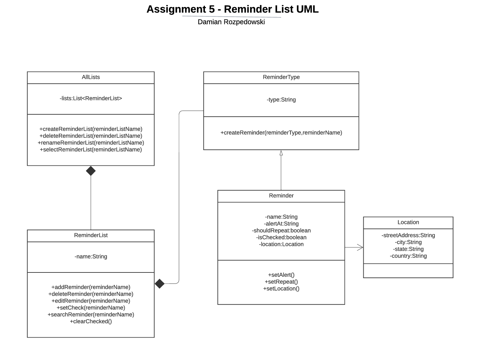
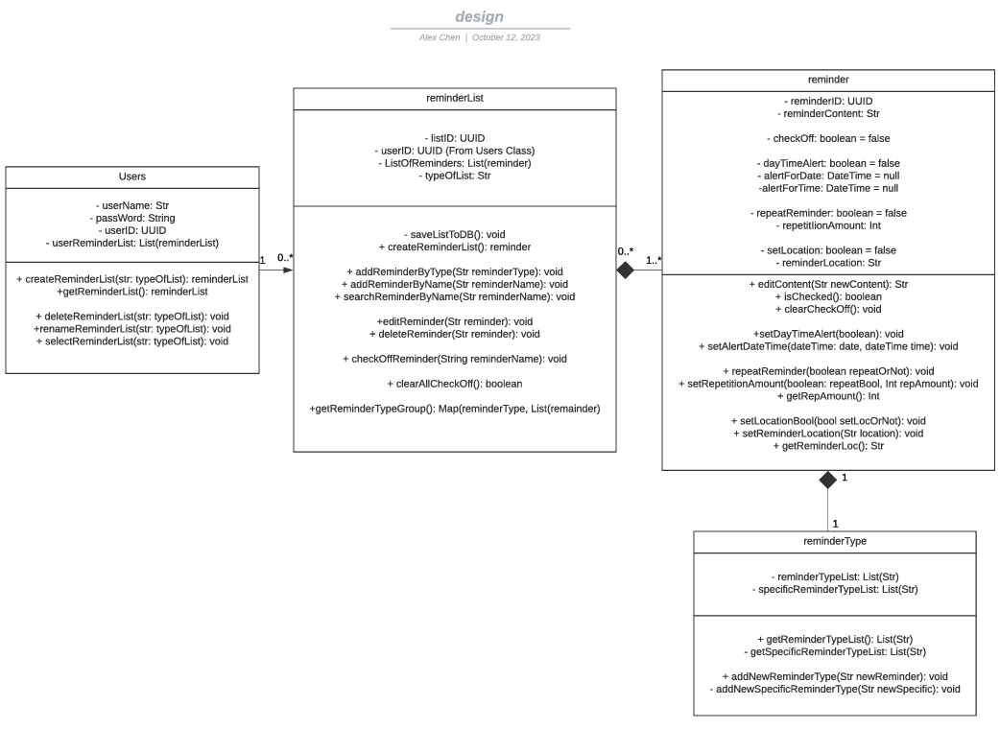
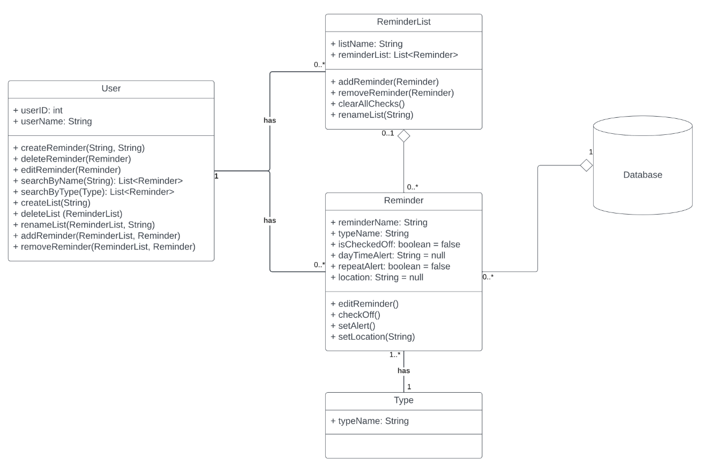
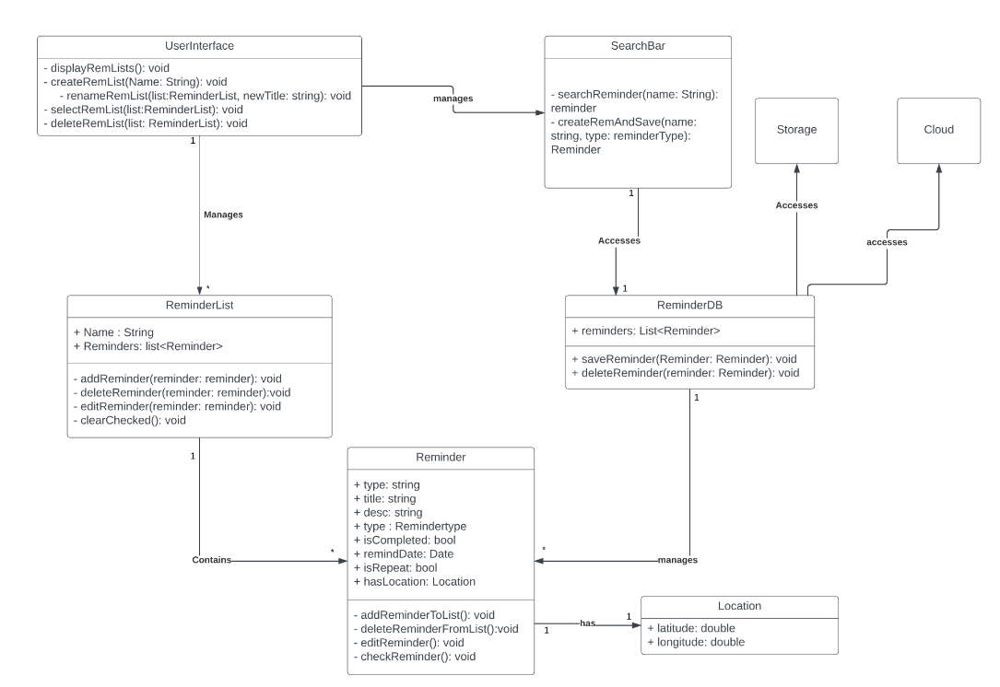
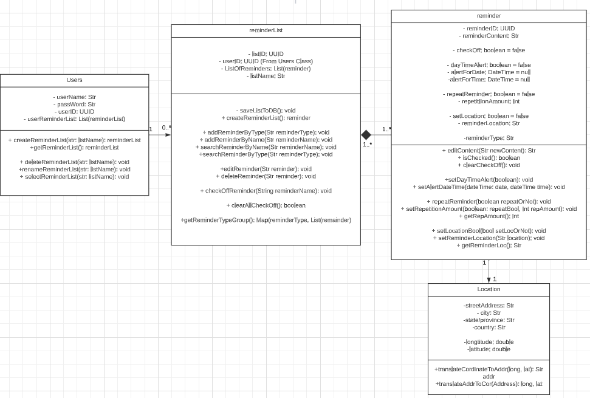

# Individual Design Discussion

## Design 1: Damian's Design

    

---

### Discussion

- Our Initial discussion of Damian's graph was that it was very simple and easy to understand with a new Location class that none of the other members had
  - After some consideration we had decided that the Location class was extremely helpful as it would be able to store more information that could be easily accessed by calling a get city method
- We also discussed how the AllList class and the User class from Design 2 are quite similar and plan to merge these two classes together
- Some shortcomings would be there aren't any multiplicities on the relations between classes and the attribute, alertAt in the Reminder class is supposed to store a date and time, but  stores it in a string which can cause issues for databases or parsing of data
  - Example: As of now the Reminder class stores the date and time as a string, "02.12.2024-08:30" which would indicate February 12th 2024, 8:30am
    - This string is only relative to the U.S. as other countries store their data format in year, month, day
    - Further it would be tedious to parse the string to get the date and time
    - This could be changed to a Date object which would be easier to parse and store in a database

---

#### Pros:
    - Good use of inheritance
    - Easy to understand
    - Location class is very helpful
    - Similarities found between AllList and User Class
#### Cons:
    - No multiplicities
    - alertAt attribute in Reminder class is a string and not a Date object

---

## Design 2: Alex's Design

    

---

### Discussion

- The discussion we had about Alex's graph was that it had taken into account how the classes/data would be stored in the database with a UUID given to each user and each reminder list
  - This can allow us to better prepare for the database construction and how data will be saved and retrieved
- We also discussed how the AllList class and the User class from Design 1 are quite similar and plan to merge these two classes together
- The separation of the reminder class and the reminderType class in order to ensure that we can reuse reminderTypes and reminders
- We found that the attribute, typeOfList in reminderList, which was supposed to denote what kind of list it should be; weekly, monthly, etc. Was a bit confusing and we discussed to have that changed to nameOfList to better represent what it is

---

#### Pros:
    - UUIDs for each user and reminder list
    - Separation of reminder and reminderType
    - Similarities found between AllList and User Class
#### Cons:
    - typeOfList attribute in reminderList is confusing and should be changed to nameOfList

---

## Design 3: Jun's Design

    

---

### Discussion

- Jun's design of the User class continued to have similarities with Alex and Damian's design and we noticed that it also had an attribute for a UUID which we had discussed earlier
  - With that in mind we had decided here to fully keep our User classes and merge them together
  - We also discussed how the User class has some functions such as edit and delete that takes in the object of the reminder as the argument, but we had decided to change it to take a string as it would be
  tedious to get the object of the reminder and pass it in as an argument and then find the argument within the list in order to modify it
  - We found that the type class was a bit confusing as it was just used to store a string, and we elaborated further and decided to place the type as an attribute in our reminder class
- In terms of the database, we discussed how data should be stored, and we had originally had reminders stored in the database and have each reminder be unique
  - We then began thinking that if we turn off the app or close the app will the reminderList data persist through this shutdown?
  - We decided that reminders should be a seperate table that has unique reminders
    - The ReminderList table would store a reference to the reminder table, but it should also ensure that a reminder that should be modified on the list should not modify the reminder table

---

#### Pros:
    - UUIDs for each user and reminder list
    - Combination of reminder and reminderType
    - Similarities found between AllList and User Class
    - Seperation of reminder and reminderList in the database
#### Cons:
    - Edit and delete functions in User class should take in a string as an argument instead of an object of the reminder
    - Database figure should not be displayed in a UML class design

---

## Design 4: Daniel's Design

    

---

### Discussion

- Daniel's design included a searchBar class along with a reminderDB class that none of us had
  - We noticed that the ReminderDB was supposed to access the storage along with the cloud, but it seemed redundant as it had the exact same attributes as the ReminderList class
  - We decided to remove the ReminderDB class and have the ReminderList class take in the attributes and methods of the removed class
  - Furthermore as we discussed with Jun's design we will have the data within reminderList and reminder to be stored within the database, however we should have a class or at least a set of methods that communicate with our database
- The SearchBar class is interesting in that it searches/creates/saves reminders
  - Location class that stores longitude and latitude which is used by the user when they would like to set an alert for a reminder that correlates to a location
    - Would require the user to input a plaintext location and we could possibly use Google API to convert it into a longitude and latitude
    - Then have the app ping the API with its current coordinates and if after some predetermined difference from current location to destination location is met then the app will send a notification to the user
    - Still requires a location in the form of what was given in design 1

---

#### Pros:
    - Location class with longitude and latitude should be kept along side the plaintext location as seen in design 1
    - Same/Similar User class
    - Reminder class includes the type of reminder within its attributes
    - 
#### Cons:
    - ReminderDB class is redundant and should be removed
    - Database figure should not be displayed in a UML class design
---

## Design 5: Sarker's Design

#### Placeholder: Current Design Unavailable

---

# Team Design

    

---

### Discussion

- We all had a main class in the form of a User class that would interact with all the other classes in order to create reminders. With that in mind we decided to combine all of our designs of this primary class into one
- We also decided to keep the Location class as it would be helpful to have a class that stores the precise information of a location in terms of plaintext english and longitude and latitude
  - The idea that we established was that eventually we would use some map API in order to translate a user inputted location into a longitude and latitude and periodically get the user's current location and compare it with the destination location in order to determine when to notify the user of the reminder
- We also decided to keep the Reminder class as it was a class that stored the information of a reminder and we decided to get rid of the reminderType class and its add it on as an attribute to the reminder class
This is because we saw the majority of our remainderType classes were just holding a single string attribute that was used to denote the difference between appointment and doctor's appointment; a small adjustment that we could not justify creating a class for
- Our ReminderList and Reminder class were generally the same with a few attributes and methods that were different and we decided to combine them into the final diagram after careful consideration and discussion to ensure that each method and attribute were in their right place along with no redundancies

---

## Summary

### Simplicity and Clarity

Throughout all of our designs we learned the value of simplicity, where a comprehensible and straightforward design can beneficial, this not only allow others to understand it but also allows the author of the diagram to understand it and explain it in a more efficient manner.

### Forethought and Flexibility

We also learned the value of forethought and flexibility, where we had to consider how our design would be implemented and how it would be used in the future. This allowed us to make changes to our collective design in order to prepare for future requirements.

### Teamwork

We also learned the value of teamwork, where we had to work together to create a design that would be beneficial to all of us and would be able to be implemented in the future. This allowed us develop our interpersonal communication skills, and discuss our ideas and thoughts in order to create a design that we all understood, agreed on the finer details and have a mental picture of how we can implement this app in the future.

### Consistency

We understood the value of consistency, we came into the group project with many different interpretations on how the application should be built.

The difference between the designs were easy to see, but understanding why a team member had a different design required careful probing and discussion, which would allow the teammate to open up and explain their diagram in much finer detail.

We had to ensure that our design and interpretation throughout the final diagram creation process was consistent with the rest of the team and we were all on the same page, we had to ensure that our final design, after its many rigorous changes was still consistent with the requirements of the project after all of the compromises and removal of unnecessary information.

