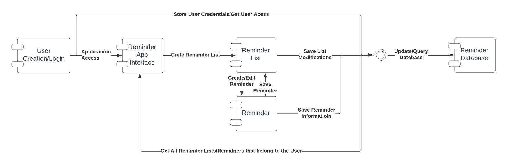
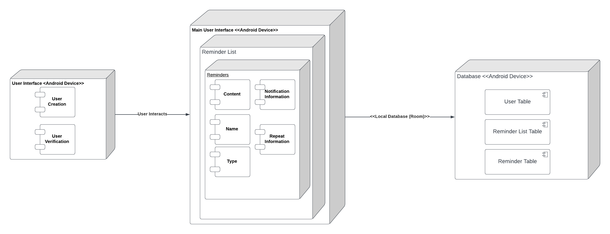
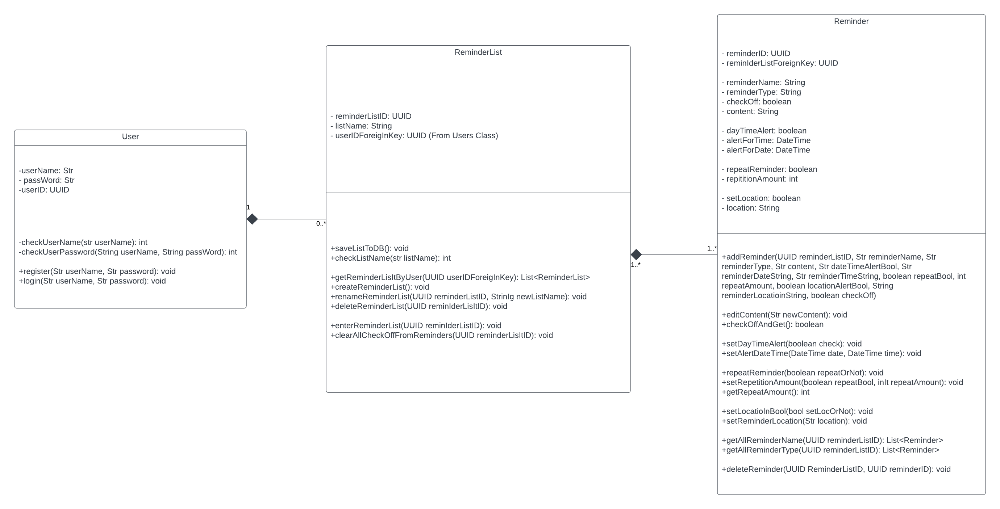
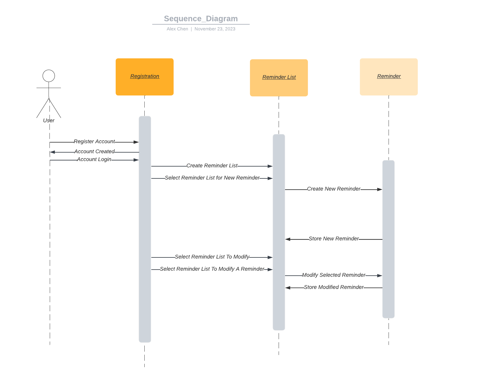
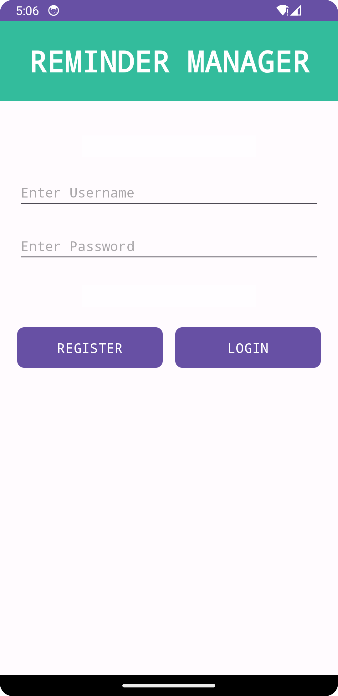
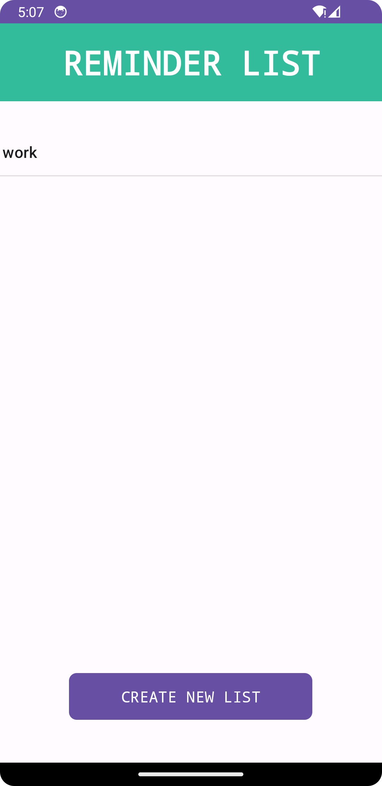
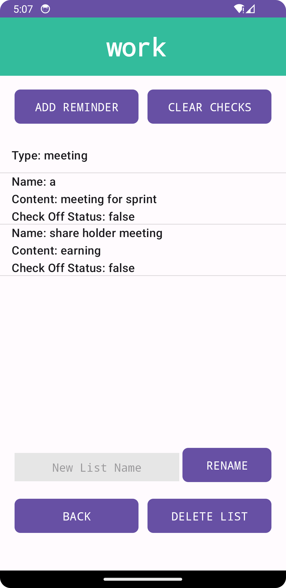
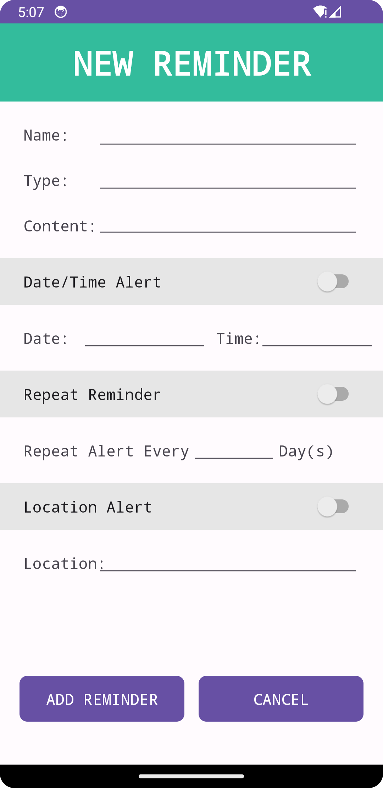
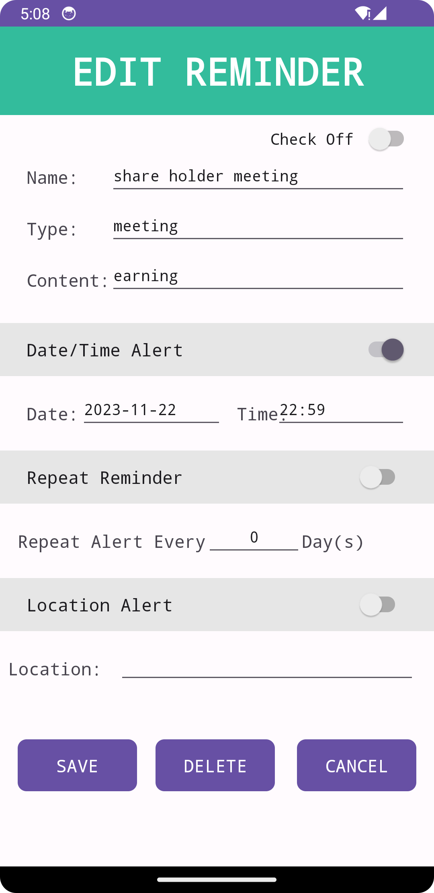

# Design Document
**Author**: [Team 2] Alex Chen, Damian Rozpedowski, Daniel Zheng, Jun Mei He, Sarker Sakib

---

## 1. Design Considerations

### 1.1. Assumptions
**The following assumptions are made within the development of this application:**

* We will not be hashing the passwords stored on the data, it is assumed that the plain text password is secure enough. We as a group understand that storing a password as plain text in a database is large liability in terms of security, but in order to avoid complications we will keep it as plain text in the mean time.
* The plan we have with the location alert, we assume we will be able to periodically check the user's location and compare it to the location of the reminder.
* We assume that the Google map API that we plan on using will provide the proper functionality to allow us to implement the location alert feature.
* We assume that there will be a MySQL database that will have ample security in order to store the user's information.
* The Application will make a connection to a database that has every user's information stored. We are going on the assumption that the user will not try to act maliciously and attempt to query other users' information.

---

### 1.2. Constraints
1) The user will need to have a stable internet connection in order to use the application.
2) We assume the user will continue to have their app open in the background in order to receive the location and date alerts. If not, the user will have their reminders saved on the database, they may not receive alerts anymore.
3) We assume that the user will have a device that is capable of running the application.

---

### 1.3. System Environment
1) The User's device must support location sharing.
2) The User's device must support the Android API Version 25.

---

## 2. Architectural Design
### 2.1. Component Diagram

The component diagram above shows the different components that make up the Reminder Application.

#### The components are as follows:

* **User Creation Component:** Which allows the user to register an account with the application, and stores the user's information in the database
* **Reminder App Interface:** The interface that the user will interact with in order to create, modify, and delete reminder lists and reminders
* **Reminder List Component:** The component that allows the user to create, modify, and delete reminder lists, it is also in charge of storing reminders in an organized manner, search for reminders, and display the lists onto the interface
* **Reminder Component:** The component that allows the user to create, modify, and delete reminders. It is here where the user can set reminders for a date, repeat reminder, and set a location alert; storing all changes to the database
* **Location Component:** This component is used if the user selects a reminder to be alerted at a specific location, it will take in an address an pass it to the Location API Component
* **Location API Component:** This component will take in an address and convert it to a latitude and longitude coordinate, it will then pass it to the Location Component
* **Reminder Database Component:** This component is in charge of storing all the user's information along with any reminder list/reminder data, it will be accessed by the User Creation Component, Reminder List Component, and Reminder

---

### 2.2. Deployment Diagram

The deployment diagram above shows the different components that make up the Reminder Application and how they will be deployed on actual hardware devices.

* The User Interface and the Application Backend will be stored and deployed on the user's device. The User Interface will have the User Creation Component and the Reminder App Interface, which is where the user will be able to modify any reminder list and reminder
* The Application Back End will house the data for the reminders along with the data structures used to store them
* The Database server will be implemented on a linux machine using MySQL, it will store user information and reminder data. The Application Back End will be able to query the database to retrieve and store data
* The Location API will be implemented using Google's API–it will be used to convert an address to a latitude and longitude coordinate. The Location API will be used by the Location Component to convert an address to a coordinate and vice versa.

---

## 3. Low-Level Design

### 3.1. Class Diagram

---

### 3.2. Other Diagrams

#### Sequence Diagram

A Sequence Diagram that shows the flow of the application when a user creates a reminder list and a reminder.

* When the user first launches the app, they will be greeted with a registration page and after signing up they will have access to the main page which allows the user to begin creating their reminder lists and reminders
* The User can then proceed to create a reminder list, or if they already have one, specify the list they would like to add a reminder to
* The User can then proceed to create a reminder, specifying the content, type, location, repeat, and alert on date/time. If alert at location is selected the user will be prompted to enter the address of the location for the reminder
* The reminder is returned by to the reminder list for it to be stored
* The User can also modify the reminder list and reminder by selecting the reminder list and reminder they want to modify, and then specifying the changes they want to make
* After changes to an existing reminder are made, the reminder is returned to the reminder list for it to be stored

---

## 4. User Interface Design

### Registration/Login Page

---

### Reminder Lists Page

---

### 'Work' Reminder List Page

---

### Create Reminder Page

---

### Edit Meeting Reminder Page

