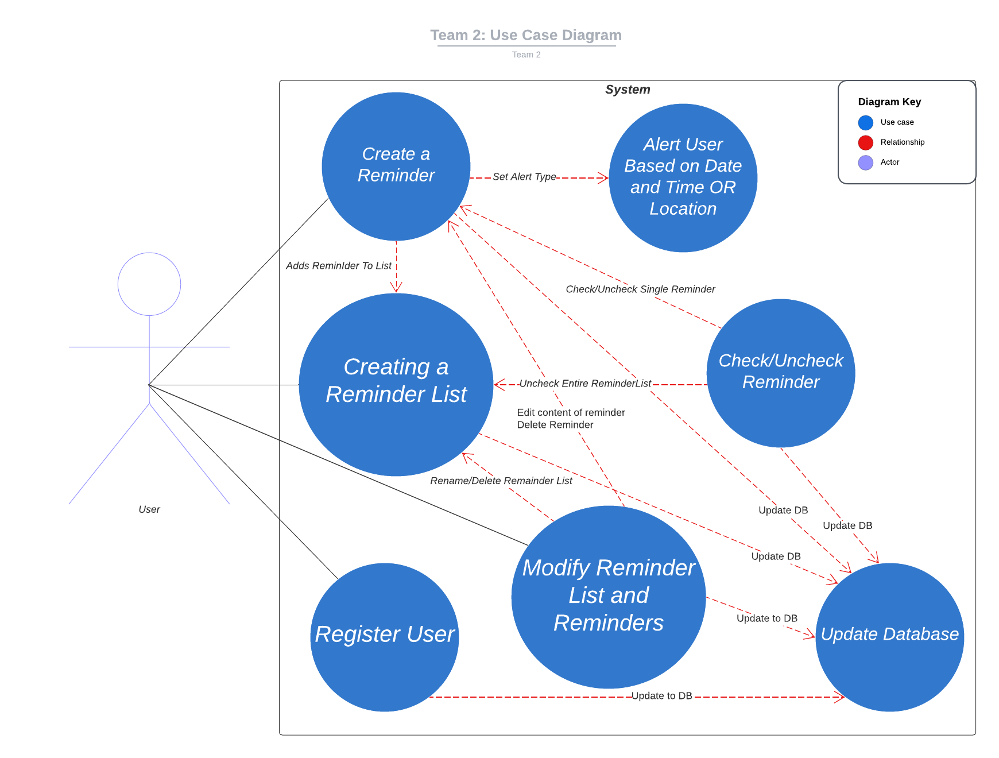

# Use Case Model
**Author**: [Team 2] Alex Chen, Damian Rozpedowski, Daniel Zheng, Jun Mei He, Sarker Sakib

---

## 1. Use Case Diagram

---

## 2. Use Case Descriptions
### 2.1. Register User
* **Requirement:** Allows the user to register for an account
* **Pre-conditions:** The new User should provide a unique username and a sufficiently secure password
* **Post-conditions:** The User is assigned a UUID and the information is stored in the database
* **Scenarios:**
  * **Normal**
    * A new User has not registered for an account
    * User enters a unique username and a secure password
    * User is registered successfully and is allowed in the app, username and password is stored in database with UUID
  * **Alternate**
    * A new User has not registered for an account
    * User enters a username that is already taken/password is not secure enough
    * User is prompted to enter a different username and password with the correct requirements
    * User enters a unique username and a secure password
    * User is registered successfully and is allowed in the app, username and password is stored in database with UUID
  * **Exceptional**
    * A new User has not registered for an account
    * User enters a username/password that is trying a SQL injection, or is too long
    * User is prompted to enter a different username and password with the correct requirements
    * User enters a unique username and a secure password
    * User is registered successfully and is allowed in the app, username and password is stored in database with UUID

---
### 2.2. Creating a Reminder List
* **Requirement:** Allows the user to create a reminder list with a unique name that is unique only for this particular user
* **Pre-conditions:** Valid User Account, and List Name provided by the User
* **Post-conditions:** List is created and stored in a ReminderList table within the database, List is placed into the User's `List<ReminderList>` Data Structure
* **Scenarios:**
  * **Normal**
    * User Account has been created
    * User enters a unique List Name
    * List is created and stored in the database
    * List is placed into the user's `List<ReminderList>` Data Structure
  * **Alternate**
    * User Account has been created
    * User enters a List Name that is already taken
    * User is prompted to enter a different List Name
    * User enters a unique List Name
    * List is created and stored in the database
    * List is placed into the user's `List<ReminderList>` Data Structure
  * **Exceptional**
    * User Account has been created
    * User enters a List Name that is trying a SQL injection, or is too long
    * User is prompted to enter a different List Name
    * User enters a unique List Name
    * List is created and stored in the database
    * List is placed into the user's `List<ReminderList>` Data Structure

---
### 2.3. Create a Reminder
* **Requirement:** Allows the user to create a reminder with content, type of reminder, alert at location option, repeat option, and alert at a specific date option
* **Pre-conditions:** User Account, List Name, Reminder Content, Reminder Type, Reminder Location, Reminder Repeat, Reminder Alert at Date
* **Post-conditions:** Reminder is created and stored in the reminder table within database, Reminder is placed into the user's reminder list that was specified
* **Scenarios:**
  * **Normal**
    * User Account has been created
    * User enters a List Name
    * User enters a reminder type (Ex: Appointment)
    * User enters a reminder name (Ex: Doctor's Appointment)
    * User enters reminder content
    * The User is given an option to set a reminder alert at a location, repeat, and alert at a specific date
    * Reminder is added to the list specified and a unique reminder is stored in the reminder table. If the reminder already exists it should not be stored, furthermore the user should see recommendations of the reminders that are currently in the database.
  * **Alternate**
    * User Account has been created
    * User enters a List Name that doesn't exist
    * User is prompted to enter a different List Name
    * User enters a List Name that exists

---

### 2.4. Modify a Reminder List and Reminders
* **Requirement:** Allows the user to modify a reminder list and reminders, including the content, type of reminder, alert at location option, repeat option, and alert at a specific date option
* **Pre-conditions:** User Account, List Name, Reminder Content, Reminder Type, Reminder Location, Reminder Repeat, Reminder Alert at Date
* **Post-conditions:** Reminder or Reminder List is modified and stored in their respective tables within the database, Reminder is placed into the user's reminder list that was specified
* **Scenarios:**
  * **Normal 1**
    * User Account has been created
    * User enters the name of the list they would like to modify
    * User can rename or delete the list
    * Database is updated with the new list name or the list is deleted
  * **Normal 2**
    * User Account has been created
    * User enters a reminder they would like to modify
    * User specifies the reminder list the reminder is coming from
    * User can modify the reminder content, type, location, repeat, alert, and check-off
    * Database is updated with the new reminder information
  * **Alternate**
    * User Account has been created
    * User enters a List Name that doesn't exist
    * User is prompted to enter a different List Name

---

### 2.5. Set Reminder Alert on Location/Date
* **Requirement:** Allows the user to set a reminder to be triggered when the user is within a certain radius of a location or at a specific date
* **Pre-conditions:** User Account, List Name, Reminder Name, Reminder Location, Reminder Repeat, Reminder Alert at Date
* **Post-conditions:** Reminder is modified and stored in the reminder table within database, Reminder within the specified reminder list is updated
* **Scenarios:**
  * **Normal**
    * User Account has been created
    * User enters a List Name
    * User enters a reminder type and name
    * User enters reminder content
    * The User is given an option to set a reminder alert at a location or at a specific date
    * User enters a location or date
    * Location should be stored and compared with current data to provide alert when near location
    * Date should be stored and compared with current data to provide alert when date is reached
    * Update reminder in database and reminder list
  * **Exceptional**
    * User Account has been created
    * User enters a List Name that doesn't exist
    * User is prompted to enter a different List Name
    * User enters a List Name that exists
    * User enters a reminder name that doesn't exist
    * User is prompted to enter a different reminder name
    * User enters a reminder name that exists
    * User enters a location or date
    * Location does not exist or date is invalid
    * User is prompted to enter a different location or date
    * User enters a location or date
    * Location should be stored and compared with current data to provide alert when near location

---

### 2.6. Check and Uncheck Reminder
* **Requirement:** Allows the user to check and uncheck reminders, or uncheck an entire reminder List
* **Pre-conditions:** User Account, List Name, Reminder Name
* **Post-conditions:** Reminder is checked or unchecked, Reminder within the specified reminder list is updated, or entire reminder list is unchecked
* **Scenarios:**
  * **Normal**
    * User Account has been created
    * User enters a List Name
    * User enters a reminder name
    * User checks or unchecks the reminder
    * Reminder information in the database is updated
  * **Alternate**
    * User Account has been created
    * User enters a List Name
    * User unchecks entire list
    * Reminder information for that reminder list in the database is updated

---
### 2.7. Update Database
* **Requirement:** Allows all the use cases to update the database
* **Pre-conditions:** User Account, List Name, Reminder Name, Existing information has been modified
* **Post-conditions:** Database is updated with the new information
* **Scenarios:**
  * **Normal**
    * Any information that has been changed within the application
    * Database is updated with the new information
    * User is able to see the updated information
